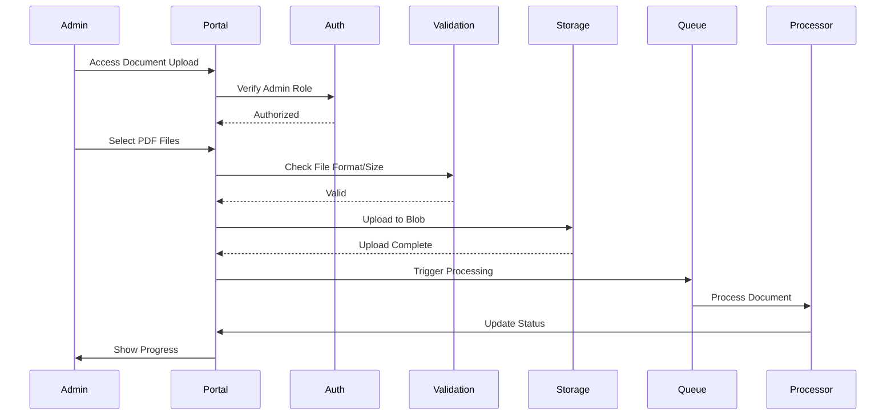

# Administrator Workflow Plan
## Document Management & System Administration

### Executive Summary
This plan defines the administrative workflows for managing documents, users, and system configuration in the document-grounded Q&A application.

### Admin Portal Architecture

```
┌─────────────────────────────────────────────────────────────┐
│                     Admin Dashboard                          │
├─────────────┬──────────────┬──────────────┬────────────────┤
│  Document   │    User      │   System     │   Analytics    │
│ Management  │ Management   │   Config     │   & Reports    │
├─────────────┼──────────────┼──────────────┼────────────────┤
│ • Upload    │ • User CRUD  │ • Settings   │ • Usage Stats  │
│ • Process   │ • Roles      │ • API Keys   │ • Performance  │
│ • Delete    │ • Permissions│ • Limits     │ • Costs        │
│ • Metadata  │ • Groups     │ • Features   │ • Insights     │
└─────────────┴──────────────┴──────────────┴────────────────┘
```

### 1. Document Management Workflows

#### 1.1 Document Upload Workflow



**Implementation Details:**

```typescript
// Document Upload Component
interface DocumentUploadProps {
  maxFileSize: number; // 50MB default
  allowedFormats: string[]; // ['.pdf']
  batchLimit: number; // 10 files per batch
}

const DocumentUploadComponent: React.FC = () => {
  const [files, setFiles] = useState<File[]>([]);
  const [uploadProgress, setUploadProgress] = useState<Map<string, number>>();
  const [processingStatus, setProcessingStatus] = useState<Map<string, Status>>();
  
  const handleUpload = async (files: FileList) => {
    // Validation
    for (const file of files) {
      if (!validateFile(file)) {
        showError(`Invalid file: ${file.name}`);
        continue;
      }
      
      // Upload with progress tracking
      const uploadTask = uploadDocument(file);
      uploadTask.on('progress', (progress) => {
        setUploadProgress(prev => new Map(prev).set(file.name, progress));
      });
      
      // Trigger processing
      const result = await uploadTask;
      await triggerProcessing(result.documentId);
      
      // Monitor processing status
      subscribeToProcessingStatus(result.documentId, (status) => {
        setProcessingStatus(prev => new Map(prev).set(file.name, status));
      });
    }
  };
};
```

#### 1.2 Bulk Document Operations

**Bulk Upload Interface:**
```typescript
interface BulkUploadConfig {
  source: 'local' | 'url' | 'azure_storage';
  metadata: {
    category?: string;
    tags?: string[];
    accessLevel?: 'public' | 'restricted' | 'private';
    expirationDate?: Date;
  };
  processingOptions: {
    priority: 'low' | 'normal' | 'high';
    chunkSize?: number;
    language?: string;
    ocrEnabled?: boolean;
  };
}

// CSV Import Format
// filename,category,tags,access_level,expiration_date
// "report_2024.pdf","Annual Reports","finance,2024","restricted","2025-12-31"
```

#### 1.3 Document Processing Pipeline

```python
# Document Processing Steps
class DocumentProcessingPipeline:
    def __init__(self):
        self.steps = [
            ValidateDocument(),
            ExtractText(),
            DetectLanguage(),
            CleanText(),
            ChunkText(),
            GenerateEmbeddings(),
            StoreInVectorDB(),
            UpdateMetadata(),
            NotifyCompletion()
        ]
    
    async def process(self, document_id: str):
        document = await self.fetch_document(document_id)
        context = ProcessingContext(document)
        
        for step in self.steps:
            try:
                await step.execute(context)
                await self.update_status(document_id, f"Completed: {step.name}")
            except Exception as e:
                await self.handle_error(document_id, step, e)
                if step.is_critical:
                    raise
        
        return context.result
```

#### 1.4 Document Metadata Management

```typescript
interface DocumentMetadata {
  id: string;
  filename: string;
  uploadedBy: string;
  uploadedAt: Date;
  processingStatus: 'pending' | 'processing' | 'completed' | 'failed';
  
  // Content metadata
  pageCount: number;
  wordCount: number;
  language: string;
  summary?: string;
  
  // Access control
  accessLevel: 'public' | 'restricted' | 'private';
  allowedUsers?: string[];
  allowedGroups?: string[];
  
  // Organization
  category: string;
  tags: string[];
  version: number;
  parentDocumentId?: string;
  
  // Processing metadata
  chunks: number;
  embeddingsDimension: number;
  processingTime: number;
  indexedAt?: Date;
  
  // Usage statistics
  queryCount: number;
  lastQueried?: Date;
  relevanceScore: number;
}
```

### 2. User Management Workflows

#### 2.1 User Registration & Onboarding

```typescript
// User Registration Flow
const UserRegistrationWorkflow = {
  steps: [
    {
      name: 'Email Verification',
      action: async (email: string) => {
        await sendVerificationEmail(email);
        return await waitForVerification(email, timeout: 3600);
      }
    },
    {
      name: 'Profile Creation',
      action: async (userData: UserData) => {
        const user = await createUser(userData);
        await assignDefaultRole(user.id, 'viewer');
        return user;
      }
    },
    {
      name: 'Welcome Setup',
      action: async (userId: string) => {
        await sendWelcomeEmail(userId);
        await createUserPreferences(userId);
        await logActivity(userId, 'registration_complete');
      }
    }
  ]
};
```

#### 2.2 Role-Based Access Control (RBAC)

```typescript
// Role Definitions
const Roles = {
  SuperAdmin: {
    permissions: ['*'],
    description: 'Full system access'
  },
  Admin: {
    permissions: [
      'documents:*',
      'users:read',
      'users:update',
      'analytics:*',
      'settings:read'
    ],
    description: 'Document and user management'
  },
  DocumentManager: {
    permissions: [
      'documents:create',
      'documents:update',
      'documents:delete',
      'documents:process',
      'analytics:documents'
    ],
    description: 'Full document control'
  },
  Analyst: {
    permissions: [
      'documents:read',
      'questions:*',
      'analytics:read',
      'export:*'
    ],
    description: 'Advanced querying and analysis'
  },
  Viewer: {
    permissions: [
      'documents:read',
      'questions:create',
      'questions:read:own'
    ],
    description: 'Basic read and query access'
  }
};

// Permission Checking Middleware
const checkPermission = (required: string) => {
  return async (req: Request, res: Response, next: NextFunction) => {
    const user = req.user;
    const userPermissions = await getUserPermissions(user.id);
    
    if (hasPermission(userPermissions, required)) {
      next();
    } else {
      res.status(403).json({ error: 'Insufficient permissions' });
    }
  };
};
```

#### 2.3 User Group Management

```typescript
interface UserGroup {
  id: string;
  name: string;
  description: string;
  members: string[];
  permissions: string[];
  documentAccess: {
    categories?: string[];
    tags?: string[];
    specificDocuments?: string[];
  };
  settings: {
    maxQueriesPerDay?: number;
    dataExportAllowed?: boolean;
    apiAccess?: boolean;
  };
}

// Group Management API
class GroupManagementService {
  async createGroup(group: UserGroup): Promise<UserGroup> {
    // Validate group settings
    this.validateGroup(group);
    
    // Create group in database
    const created = await this.db.groups.create(group);
    
    // Update user associations
    for (const userId of group.members) {
      await this.addUserToGroup(userId, created.id);
    }
    
    return created;
  }
  
  async syncGroupPermissions(groupId: string): Promise<void> {
    const group = await this.getGroup(groupId);
    const members = await this.getGroupMembers(groupId);
    
    for (const member of members) {
      await this.updateUserPermissions(member.id, group.permissions);
    }
  }
}
```

### 3. System Configuration Workflows

#### 3.1 Global Settings Management

```typescript
interface SystemSettings {
  general: {
    applicationName: string;
    supportEmail: string;
    maintenanceMode: boolean;
    maintenanceMessage?: string;
  };
  
  documents: {
    maxUploadSize: number; // MB
    allowedFormats: string[];
    autoProcessing: boolean;
    defaultChunkSize: number;
    retentionDays: number;
  };
  
  ai: {
    openAiModel: string;
    temperature: number;
    maxTokens: number;
    embeddingModel: string;
    contextWindow: number;
  };
  
  security: {
    sessionTimeout: number; // minutes
    maxLoginAttempts: number;
    passwordPolicy: {
      minLength: number;
      requireUppercase: boolean;
      requireNumbers: boolean;
      requireSpecialChars: boolean;
    };
    ipWhitelist: string[];
  };
  
  limits: {
    maxQueriesPerUser: number;
    maxDocumentsPerUser: number;
    maxConcurrentUploads: number;
    rateLimiting: {
      requestsPerMinute: number;
      requestsPerHour: number;
    };
  };
}
```

#### 3.2 API Key Management

```typescript
interface ApiKey {
  id: string;
  name: string;
  key: string;
  userId: string;
  createdAt: Date;
  lastUsed?: Date;
  expiresAt?: Date;
  
  permissions: string[];
  rateLimit: {
    requestsPerMinute: number;
    requestsPerDay: number;
  };
  
  restrictions: {
    ipWhitelist?: string[];
    allowedOrigins?: string[];
    allowedEndpoints?: string[];
  };
  
  usage: {
    totalRequests: number;
    monthlyRequests: number;
    lastResetDate: Date;
  };
}

// API Key Service
class ApiKeyService {
  async generateKey(config: ApiKeyConfig): Promise<ApiKey> {
    const key = this.generateSecureKey();
    const hashedKey = await this.hashKey(key);
    
    const apiKey = await this.db.apiKeys.create({
      ...config,
      key: hashedKey,
      plainKey: key // Return once, never stored
    });
    
    await this.auditLog('api_key_created', apiKey.id);
    
    return apiKey;
  }
  
  async rotateKey(keyId: string): Promise<ApiKey> {
    const oldKey = await this.getKey(keyId);
    const newKey = await this.generateKey(oldKey.config);
    
    await this.revokeKey(keyId);
    await this.notifyKeyRotation(oldKey.userId, newKey);
    
    return newKey;
  }
}
```

### 4. Analytics & Reporting Workflows

#### 4.1 Usage Analytics Dashboard

```typescript
interface AnalyticsDashboard {
  overview: {
    totalUsers: number;
    activeUsers: number;
    totalDocuments: number;
    totalQueries: number;
    avgResponseTime: number;
    systemUptime: number;
  };
  
  trends: {
    period: 'day' | 'week' | 'month';
    queryVolume: TimeSeries;
    userActivity: TimeSeries;
    documentUploads: TimeSeries;
    errorRate: TimeSeries;
  };
  
  topMetrics: {
    mostQueriedDocuments: DocumentStat[];
    mostActiveUsers: UserStat[];
    popularQuestions: QuestionStat[];
    commonSearchTerms: string[];
  };
  
  performance: {
    avgProcessingTime: number;
    avgQueryLatency: number;
    embeddingGenerationTime: number;
    searchAccuracy: number;
  };
}
```

#### 4.2 Cost Tracking & Optimization

```typescript
interface CostAnalytics {
  current: {
    daily: number;
    monthly: number;
    projected: number;
  };
  
  breakdown: {
    compute: number;
    storage: number;
    ai_services: number;
    networking: number;
    other: number;
  };
  
  optimization_suggestions: [
    {
      type: 'storage_cleanup',
      potential_savings: number,
      description: 'Remove unused embeddings older than 30 days'
    },
    {
      type: 'compute_scaling',
      potential_savings: number,
      description: 'Scale down during off-peak hours'
    }
  ];
}
```

### 5. Maintenance & Operations Workflows

#### 5.1 Scheduled Maintenance

```typescript
interface MaintenanceWindow {
  id: string;
  type: 'planned' | 'emergency';
  startTime: Date;
  endTime: Date;
  affectedServices: string[];
  
  tasks: [
    {
      name: string;
      script: string;
      estimatedDuration: number;
      rollbackScript?: string;
    }
  ];
  
  notifications: {
    advance_notice: number; // hours
    reminder: number; // minutes
    channels: ('email' | 'sms' | 'in_app')[];
  };
  
  status: 'scheduled' | 'in_progress' | 'completed' | 'failed';
}

// Maintenance Executor
class MaintenanceExecutor {
  async executeMainenance(window: MaintenanceWindow): Promise<void> {
    // Pre-maintenance
    await this.enableMaintenanceMode();
    await this.createBackup();
    
    // Execute tasks
    for (const task of window.tasks) {
      try {
        await this.executeTask(task);
      } catch (error) {
        await this.rollback(task);
        throw error;
      }
    }
    
    // Post-maintenance
    await this.runHealthChecks();
    await this.disableMaintenanceMode();
    await this.notifyCompletion();
  }
}
```

#### 5.2 Backup & Recovery

```typescript
interface BackupStrategy {
  schedule: {
    full_backup: CronExpression; // "0 2 * * 0" - Weekly
    incremental: CronExpression; // "0 * * * *" - Hourly
    retention: {
      daily: 7,
      weekly: 4,
      monthly: 12
    };
  };
  
  components: [
    {
      name: 'database',
      type: 'cosmosdb',
      backup_method: 'continuous',
      restore_test_frequency: 'monthly'
    },
    {
      name: 'documents',
      type: 'blob_storage',
      backup_method: 'snapshot',
      restore_test_frequency: 'quarterly'
    },
    {
      name: 'vectors',
      type: 'search_index',
      backup_method: 'export',
      restore_test_frequency: 'monthly'
    }
  ];
}
```

### 6. Admin Interface Implementation

#### 6.1 Admin Dashboard Layout

```tsx
// Admin Dashboard Component
const AdminDashboard: React.FC = () => {
  return (
    <div className="admin-dashboard">
      <Header>
        <UserInfo />
        <QuickActions />
        <NotificationBell />
      </Header>
      
      <Sidebar>
        <NavItem icon="documents" label="Documents" path="/admin/documents" />
        <NavItem icon="users" label="Users" path="/admin/users" />
        <NavItem icon="analytics" label="Analytics" path="/admin/analytics" />
        <NavItem icon="settings" label="Settings" path="/admin/settings" />
        <NavItem icon="logs" label="Audit Logs" path="/admin/logs" />
      </Sidebar>
      
      <MainContent>
        <Routes>
          <Route path="/documents" element={<DocumentManagement />} />
          <Route path="/users" element={<UserManagement />} />
          <Route path="/analytics" element={<Analytics />} />
          <Route path="/settings" element={<SystemSettings />} />
          <Route path="/logs" element={<AuditLogs />} />
        </Routes>
      </MainContent>
      
      <Footer>
        <SystemStatus />
        <VersionInfo />
      </Footer>
    </div>
  );
};
```

#### 6.2 Real-time Monitoring Dashboard

```typescript
// WebSocket Connection for Real-time Updates
class RealtimeMonitor {
  private socket: WebSocket;
  private subscribers: Map<string, Set<Function>>;
  
  connect(): void {
    this.socket = new WebSocket('wss://api.docqa.com/admin/realtime');
    
    this.socket.onmessage = (event) => {
      const update = JSON.parse(event.data);
      this.notifySubscribers(update.type, update.data);
    };
  }
  
  subscribe(eventType: string, callback: Function): void {
    if (!this.subscribers.has(eventType)) {
      this.subscribers.set(eventType, new Set());
    }
    this.subscribers.get(eventType).add(callback);
  }
  
  private notifySubscribers(eventType: string, data: any): void {
    const callbacks = this.subscribers.get(eventType) || [];
    callbacks.forEach(callback => callback(data));
  }
}

// Usage in component
useEffect(() => {
  const monitor = new RealtimeMonitor();
  monitor.connect();
  
  monitor.subscribe('document.processing', (data) => {
    updateProcessingStatus(data);
  });
  
  monitor.subscribe('system.metrics', (data) => {
    updateSystemMetrics(data);
  });
  
  return () => monitor.disconnect();
}, []);
```

### 7. Audit & Compliance

#### 7.1 Audit Logging

```typescript
interface AuditLog {
  id: string;
  timestamp: Date;
  userId: string;
  action: string;
  resource: {
    type: string;
    id: string;
    name?: string;
  };
  details: {
    before?: any;
    after?: any;
    metadata?: Record<string, any>;
  };
  ip_address: string;
  user_agent: string;
  result: 'success' | 'failure';
  error_message?: string;
}

// Audit Logger
class AuditLogger {
  async log(event: AuditEvent): Promise<void> {
    const log: AuditLog = {
      id: generateId(),
      timestamp: new Date(),
      userId: event.userId,
      action: event.action,
      resource: event.resource,
      details: event.details,
      ip_address: event.request.ip,
      user_agent: event.request.headers['user-agent'],
      result: event.result
    };
    
    // Store in database
    await this.db.auditLogs.create(log);
    
    // Send to SIEM if configured
    if (this.siemEnabled) {
      await this.sendToSiem(log);
    }
    
    // Alert on suspicious activity
    if (this.isSuspicious(log)) {
      await this.alertSecurityTeam(log);
    }
  }
}
```

### 8. Integration with External Systems

#### 8.1 Single Sign-On (SSO) Integration

```typescript
// Azure AD Integration
const ssoConfig = {
  provider: 'azure-ad',
  clientId: process.env.AZURE_AD_CLIENT_ID,
  tenantId: process.env.AZURE_AD_TENANT_ID,
  redirectUri: 'https://docqa.com/auth/callback',
  
  mapping: {
    userId: 'oid',
    email: 'email',
    name: 'name',
    groups: 'groups',
    role: (claims) => {
      if (claims.groups.includes('admins')) return 'admin';
      if (claims.groups.includes('managers')) return 'document_manager';
      return 'viewer';
    }
  }
};
```

#### 8.2 External Document Sources

```typescript
interface ExternalSource {
  type: 'sharepoint' | 's3' | 'google_drive' | 'dropbox';
  config: {
    endpoint?: string;
    credentials: any;
    syncSchedule?: CronExpression;
    folders?: string[];
    filePatterns?: string[];
  };
  
  syncStatus: {
    lastSync?: Date;
    nextSync?: Date;
    documentssynced: number;
    errors: any[];
  };
}

// Document Sync Service
class DocumentSyncService {
  async syncFromExternal(source: ExternalSource): Promise<SyncResult> {
    const connector = this.getConnector(source.type);
    const documents = await connector.listDocuments(source.config);
    
    for (const doc of documents) {
      if (await this.shouldSync(doc)) {
        await this.downloadAndProcess(doc);
      }
    }
    
    return this.generateSyncReport();
  }
}
```

### Implementation Timeline

| Phase | Duration | Key Deliverables |
|-------|----------|-----------------|
| Week 1 | 5 days | Basic admin authentication and dashboard |
| Week 2 | 5 days | Document upload and management UI |
| Week 3 | 5 days | User management and RBAC |
| Week 4 | 5 days | Analytics and reporting |
| Week 5 | 5 days | System configuration and settings |
| Week 6 | 5 days | Integration and testing |

### Security Considerations

1. **Admin Access Control**
   - Multi-factor authentication required
   - IP whitelisting for admin endpoints
   - Session timeout after inactivity
   - Audit logging for all admin actions

2. **Document Security**
   - Encryption at rest and in transit
   - Access control lists per document
   - Watermarking for sensitive documents
   - Document expiration policies

3. **API Security**
   - Rate limiting per API key
   - Request signing for sensitive operations
   - API key rotation policies
   - Webhook signature verification

### Success Metrics

| Metric | Target | Measurement |
|--------|--------|-------------|
| Document Processing Time | < 30 seconds | Average processing duration |
| Admin Task Completion | < 5 clicks | User journey analysis |
| System Availability | > 99.9% | Uptime monitoring |
| User Onboarding Time | < 5 minutes | Time to first query |
| Audit Compliance | 100% | Audit log completeness |

### Next Steps

1. Review and approve admin workflow design
2. Set up admin portal development environment
3. Implement authentication and authorization
4. Build document management interface
5. Deploy to staging environment
6. Conduct admin user training