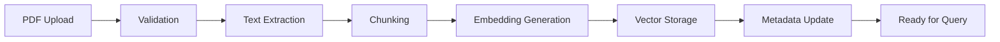

# Application Implementation Plan
## Document-Grounded Q&A System

### Executive Summary
This plan outlines the implementation of a document-grounded question and answer application that enables users to query PDF documents through a web interface, leveraging OpenAI's API for intelligent responses, and hosted on Azure infrastructure.

### System Architecture Overview

```
┌─────────────────┐     ┌──────────────────┐     ┌─────────────────┐
│   Web Browser   │────▶│   Azure CDN/     │────▶│  Azure App      │
│   (React SPA)   │     │   Static Web     │     │  Service/       │
└─────────────────┘     │   Apps           │     │  Functions      │
                        └──────────────────┘     └────────┬────────┘
                                                          │
                              ┌───────────────────────────┼───────────────────────────┐
                              │                           │                           │
                    ┌─────────▼─────────┐     ┌──────────▼────────┐     ┌────────────▼──────────┐
                    │  Azure AI Search  │     │  Azure Blob       │     │  Azure OpenAI         │
                    │  (Vector Store)   │     │  Storage          │     │  Service              │
                    └───────────────────┘     │  (PDF Storage)    │     └───────────────────────┘
                                              └───────────────────┘
```

### Phase 1: Foundation Setup (Week 1-2)

#### 1.1 Development Environment Setup
- [ ] Initialize Git repository with proper branching strategy (main, develop, feature/*)
- [ ] Set up local development environment with Docker Compose
- [ ] Configure development tools and linters (ESLint, Prettier, pre-commit hooks)
- [ ] Create project documentation structure

#### 1.2 Azure Account and Services Setup
- [ ] Create Azure subscription and resource groups for dev/qa/prod
- [ ] Set up Azure DevOps organization and project
- [ ] Configure service principals for automation
- [ ] Enable required Azure services and APIs

#### 1.3 Project Scaffolding
```bash
azure-document-ai-chat/
├── frontend/               # React/Next.js application
│   ├── src/
│   │   ├── components/    # UI components
│   │   ├── pages/        # Application pages
│   │   ├── services/     # API clients
│   │   └── utils/        # Utility functions
│   └── package.json
├── backend/               # Azure Functions/App Service
│   ├── src/
│   │   ├── functions/    # API endpoints
│   │   ├── services/     # Business logic
│   │   ├── models/       # Data models
│   │   └── utils/        # Helper functions
│   └── package.json
├── shared/               # Shared types and utilities
├── infrastructure/       # Terraform configurations
└── docs/                # Documentation
```

### Phase 2: Backend Development (Week 2-4)

#### 2.1 API Layer Implementation
**Technology Stack:** Node.js/Python with Azure Functions or Azure App Service

**Core APIs to Implement:**
```typescript
// API Endpoints
POST   /api/documents/upload     // Admin: Upload PDF documents
GET    /api/documents            // List available documents
DELETE /api/documents/{id}      // Admin: Remove documents
POST   /api/questions/ask        // Submit question
GET    /api/questions/history    // Get user's question history
POST   /api/documents/process    // Process and index document
```

#### 2.2 Document Processing Pipeline
```python
class DocumentProcessor:
    def __init__(self):
        self.pdf_parser = PDFParser()
        self.text_splitter = TextSplitter(chunk_size=1000, overlap=200)
        self.embedder = OpenAIEmbeddings()
        self.vector_store = AzureAISearch()
    
    async def process_document(self, pdf_file):
        # 1. Extract text from PDF
        text = await self.pdf_parser.extract(pdf_file)
        
        # 2. Split into chunks
        chunks = self.text_splitter.split(text)
        
        # 3. Generate embeddings
        embeddings = await self.embedder.embed(chunks)
        
        # 4. Store in vector database
        await self.vector_store.upsert(chunks, embeddings)
```

#### 2.3 Question-Answer Engine
```python
class QAEngine:
    def __init__(self):
        self.vector_store = AzureAISearch()
        self.llm = AzureOpenAI(model="gpt-4")
        self.retriever = VectorRetriever(top_k=5)
    
    async def answer_question(self, question, document_filter=None):
        # 1. Retrieve relevant context
        context = await self.retriever.retrieve(question, filter=document_filter)
        
        # 2. Build prompt
        prompt = self.build_prompt(question, context)
        
        # 3. Generate answer
        answer = await self.llm.generate(prompt)
        
        # 4. Include citations
        return {
            "answer": answer,
            "sources": context.sources,
            "confidence": self.calculate_confidence(answer, context)
        }
```

### Phase 3: Frontend Development (Week 3-5)

#### 3.1 User Interface Components
**Technology Stack:** React/Next.js with TypeScript, Tailwind CSS

**Key Components:**
```typescript
// Component Structure
components/
├── Layout/
│   ├── Header.tsx
│   ├── Sidebar.tsx
│   └── Footer.tsx
├── Documents/
│   ├── DocumentList.tsx
│   ├── DocumentUpload.tsx
│   └── DocumentViewer.tsx
├── Questions/
│   ├── QuestionInput.tsx
│   ├── AnswerDisplay.tsx
│   └── QuestionHistory.tsx
└── Admin/
    ├── AdminDashboard.tsx
    └── DocumentManagement.tsx
```

#### 3.2 State Management
```typescript
// Redux/Zustand Store Structure
interface AppState {
  user: {
    id: string;
    role: 'user' | 'admin';
    preferences: UserPreferences;
  };
  documents: {
    list: Document[];
    selected: Document | null;
    loading: boolean;
  };
  questions: {
    current: Question | null;
    history: Question[];
    processing: boolean;
  };
  ui: {
    theme: 'light' | 'dark';
    sidebarOpen: boolean;
  };
}
```

#### 3.3 User Experience Features
- [ ] Real-time question processing with loading states
- [ ] Answer streaming for better perceived performance
- [ ] Document preview with highlighted relevant sections
- [ ] Search history with filters and sorting
- [ ] Responsive design for mobile and desktop
- [ ] Accessibility compliance (WCAG 2.1 AA)

### Phase 4: Integration Layer (Week 4-5)

#### 4.1 Azure AI Search Integration
```python
# Vector search configuration
search_config = {
    "index_name": "documents-index",
    "fields": [
        {"name": "id", "type": "Edm.String", "key": True},
        {"name": "content", "type": "Edm.String", "searchable": True},
        {"name": "embedding", "type": "Collection(Edm.Single)", "dimensions": 1536},
        {"name": "metadata", "type": "Edm.ComplexType"}
    ],
    "semantic_config": {
        "configurations": [{
            "name": "default",
            "prioritized_fields": {
                "content_fields": [{"name": "content"}]
            }
        }]
    }
}
```

#### 4.2 OpenAI Integration
```python
# Azure OpenAI Service configuration
openai_config = {
    "endpoint": "https://{resource-name}.openai.azure.com",
    "api_version": "2024-02-15-preview",
    "deployment_names": {
        "embeddings": "text-embedding-ada-002",
        "chat": "gpt-4",
        "completion": "gpt-35-turbo"
    },
    "parameters": {
        "temperature": 0.7,
        "max_tokens": 1000,
        "top_p": 0.95
    }
}
```

#### 4.3 Authentication & Authorization
```typescript
// Azure AD B2C Integration
const authConfig = {
  auth: {
    clientId: process.env.AZURE_AD_CLIENT_ID,
    authority: `https://${tenant}.b2clogin.com/${tenant}.onmicrosoft.com/${policy}`,
    knownAuthorities: [`${tenant}.b2clogin.com`],
    redirectUri: process.env.REDIRECT_URI
  },
  cache: {
    cacheLocation: "sessionStorage",
    storeAuthStateInCookie: false
  }
};

// Role-based access control
const permissions = {
  user: ['documents:read', 'questions:create', 'questions:read'],
  admin: ['documents:*', 'questions:*', 'users:*', 'system:*']
};
```

### Phase 5: Document Management System (Week 5-6)

#### 5.1 Admin Portal Features
- [ ] Bulk document upload with progress tracking
- [ ] Document metadata management (tags, categories, access levels)
- [ ] Processing status dashboard
- [ ] Document analytics (usage, popular sections)
- [ ] User management and permissions

#### 5.2 Document Processing Workflow


#### 5.3 Storage Strategy
```python
# Blob Storage organization
storage_structure = {
    "containers": {
        "raw-documents": "Original PDF files",
        "processed-documents": "Extracted text and metadata",
        "document-chunks": "Chunked content for processing",
        "embeddings": "Vector embeddings cache"
    },
    "naming_convention": "{environment}/{date}/{document_id}/{version}",
    "retention_policy": {
        "raw": "indefinite",
        "processed": "90 days",
        "chunks": "30 days"
    }
}
```

### Phase 6: Testing & Quality Assurance (Week 6-7)

#### 6.1 Testing Strategy
```javascript
// Test Coverage Requirements
const testingPlan = {
  unit: {
    coverage: 80,
    frameworks: ['Jest', 'pytest'],
    focus: ['Business logic', 'Data transformations', 'API handlers']
  },
  integration: {
    coverage: 70,
    frameworks: ['Supertest', 'Cypress'],
    focus: ['API endpoints', 'Database operations', 'External services']
  },
  e2e: {
    coverage: 60,
    frameworks: ['Playwright', 'Cypress'],
    focus: ['User workflows', 'Admin operations', 'Error scenarios']
  },
  performance: {
    tools: ['K6', 'Azure Load Testing'],
    metrics: ['Response time < 2s', 'Throughput > 100 req/s', 'Error rate < 1%']
  }
};
```

#### 6.2 Test Scenarios
- [ ] Document upload and processing
- [ ] Question answering accuracy
- [ ] Concurrent user handling
- [ ] Error recovery and resilience
- [ ] Security and authorization
- [ ] Cross-browser compatibility

### Phase 7: Deployment & DevOps (Week 7-8)

#### 7.1 CI/CD Pipeline
```yaml
# Azure DevOps Pipeline
trigger:
  branches:
    include: [main, develop]

stages:
  - stage: Build
    jobs:
      - job: BuildApplication
        steps:
          - task: NodeTool@0
          - script: npm ci && npm run build
          - script: npm test
          - task: PublishBuildArtifacts@1

  - stage: DeployDev
    condition: eq(variables['Build.SourceBranch'], 'refs/heads/develop')
    jobs:
      - deployment: DeployToDev
        environment: development
        strategy:
          runOnce:
            deploy:
              steps:
                - task: AzureWebApp@1
                - task: AzureFunctionApp@1

  - stage: DeployProd
    condition: eq(variables['Build.SourceBranch'], 'refs/heads/main')
    jobs:
      - deployment: DeployToProd
        environment: production
        strategy:
          runOnce:
            deploy:
              steps:
                - task: ManualValidation@0
                - task: AzureWebApp@1
                - task: AzureFunctionApp@1
```

#### 7.2 Monitoring & Observability
```typescript
// Application Insights Configuration
const telemetryConfig = {
  instrumentationKey: process.env.APPINSIGHTS_KEY,
  telemetryInitializers: [
    (envelope) => {
      envelope.tags['ai.cloud.role'] = 'document-qa-app';
      envelope.data.baseData.properties = {
        ...envelope.data.baseData.properties,
        environment: process.env.ENVIRONMENT
      };
    }
  ],
  metrics: {
    custom: [
      'question_processing_time',
      'document_upload_duration',
      'embedding_generation_time',
      'search_relevance_score'
    ]
  }
};
```

### Phase 8: Security Implementation (Throughout)

#### 8.1 Security Measures
- [ ] API rate limiting and throttling
- [ ] Input validation and sanitization
- [ ] SQL injection prevention
- [ ] XSS protection
- [ ] CORS configuration
- [ ] Secrets management with Azure Key Vault
- [ ] SSL/TLS enforcement
- [ ] Regular security audits

#### 8.2 Data Protection
```python
# Encryption configuration
security_config = {
    "encryption": {
        "at_rest": "AES-256",
        "in_transit": "TLS 1.3",
        "key_rotation": "90 days"
    },
    "access_control": {
        "authentication": "Azure AD B2C",
        "authorization": "RBAC",
        "mfa": "required_for_admin"
    },
    "compliance": {
        "standards": ["GDPR", "SOC2", "ISO27001"],
        "audit_logging": "enabled",
        "data_retention": "configurable"
    }
}
```

### Implementation Timeline

| Phase | Duration | Dependencies | Deliverables |
|-------|----------|--------------|--------------|
| Foundation Setup | Week 1-2 | Azure account | Dev environment ready |
| Backend Development | Week 2-4 | Foundation | APIs functional |
| Frontend Development | Week 3-5 | Backend APIs | UI complete |
| Integration | Week 4-5 | Backend & Frontend | Services connected |
| Document Management | Week 5-6 | Integration | Admin portal ready |
| Testing | Week 6-7 | All components | Test reports |
| Deployment | Week 7-8 | Testing | Production ready |

### Success Metrics

#### Performance KPIs
- Question response time: < 2 seconds
- Document processing time: < 30 seconds per PDF
- System availability: > 99.9%
- Concurrent users: > 100

#### Quality Metrics
- Answer accuracy: > 85%
- User satisfaction: > 4/5 rating
- Bug density: < 5 per KLOC
- Code coverage: > 80%

### Risk Mitigation

| Risk | Impact | Mitigation Strategy |
|------|--------|-------------------|
| OpenAI API rate limits | High | Implement caching and request queuing |
| Large PDF processing | Medium | Async processing with progress updates |
| Cost overruns | High | Set up cost alerts and auto-scaling limits |
| Security breaches | Critical | Regular security audits and penetration testing |
| Performance degradation | Medium | Implement monitoring and auto-scaling |

### Next Steps
1. Review and approve implementation plan
2. Set up development team and assign roles
3. Initialize development environment
4. Begin Phase 1 implementation
5. Schedule weekly progress reviews

### Appendix A: Technology Stack Summary

#### Frontend
- Framework: React/Next.js 14
- Language: TypeScript 5
- Styling: Tailwind CSS 3
- State Management: Zustand/Redux Toolkit
- API Client: Axios/TanStack Query

#### Backend
- Runtime: Node.js 20 LTS / Python 3.11
- Framework: Express/FastAPI
- ORM: Prisma/SQLAlchemy
- Validation: Zod/Pydantic

#### Azure Services
- Compute: App Service/Functions
- Storage: Blob Storage
- Database: Cosmos DB/PostgreSQL
- Search: AI Search
- AI: OpenAI Service
- Auth: AD B2C
- Monitoring: Application Insights

#### Development Tools
- Version Control: Git/GitHub
- CI/CD: Azure DevOps
- IaC: Terraform
- Containerization: Docker
- Testing: Jest/Pytest/Cypress