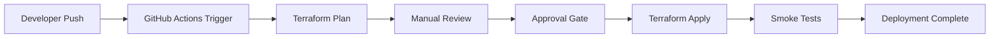

# Azure Document AI Chat - Infrastructure Implementation Plan

## Executive Summary

This implementation plan outlines the deployment of a robust Azure infrastructure for the doc-qa application using Terraform Infrastructure as Code (IaC) and GitHub Actions for CI/CD automation. The architecture supports multiple environments (dev, qa, prod) with a modular approach to minimize blast radius and ensure scalability.

## Table of Contents

1. [Architecture Overview](#architecture-overview)
2. [Infrastructure Components](#infrastructure-components)
3. [Terraform Project Structure](#terraform-project-structure)
4. [Environment Strategy](#environment-strategy)
5. [CI/CD Pipeline Design](#cicd-pipeline-design)
6. [Implementation Phases](#implementation-phases)
7. [Security Considerations](#security-considerations)
8. [Testing Strategy](#testing-strategy)
9. [Deployment Process](#deployment-process)
10. [Monitoring and Maintenance](#monitoring-and-maintenance)

## Architecture Overview

### High-Level Architecture

```
┌─────────────────────────────────────────────────────────────┐
│                     Azure Subscription                       │
├─────────────────────────────────────────────────────────────┤
│                                                              │
│  ┌────────────────────────────────────────────────────┐     │
│  │            Resource Group: doc-qa-rg-{env}         │     │
│  ├────────────────────────────────────────────────────┤     │
│  │                                                    │     │
│  │  ┌──────────────────┐    ┌──────────────────┐    │     │
│  │  │  Storage Account │    │   Function App   │    │     │
│  │  │    aspdocqa     │    │   doc-qa-api     │    │     │
│  │  │  ┌────────────┐ │    │  ┌────────────┐  │    │     │
│  │  │  │Blob: docs  │ │    │  │Python 3.11 │  │    │     │
│  │  │  └────────────┘ │    │  └────────────┘  │    │     │
│  │  └──────────────────┘    └──────────────────┘    │     │
│  │                                                    │     │
│  │  ┌──────────────────────────────────────────┐    │     │
│  │  │      App Service Plan (Consumption)      │    │     │
│  │  └──────────────────────────────────────────┘    │     │
│  └────────────────────────────────────────────────────┘     │
│                                                              │
│  ┌────────────────────────────────────────────────────┐     │
│  │    Terraform Backend Storage (Existing)            │     │
│  │    RG: Terraform-Backend-State-RG                  │     │
│  │    Storage: aspterraformstate                      │     │
│  │    Container: tfstate                              │     │
│  └────────────────────────────────────────────────────┘     │
└─────────────────────────────────────────────────────────────┘
```

### Component Interaction Flow

1. **Document Storage**: Azure Blob Storage holds documents for processing
2. **Function App**: Serverless compute processes documents using AI capabilities
3. **App Service Plan**: Consumption-based hosting for cost optimization
4. **Terraform Backend**: Centralized state management for infrastructure

## Infrastructure Components

### 1. Storage Infrastructure (terraform-storage project)

| Component | Details |
|-----------|---------|
| **Resource Group** | doc-qa-rg-{env} (East US) |
| **Storage Account** | aspdocqa{env} (Standard LRS) |
| **Blob Container** | docs |
| **Purpose** | Document storage and retrieval |
| **Replication** | Locally Redundant Storage |

### 2. Application Infrastructure (terraform-app project)

| Component | Details |
|-----------|---------|
| **Function App** | doc-qa-api-{env} |
| **Runtime** | Python 3.11 |
| **Hosting Plan** | Consumption (Serverless) |
| **Storage** | Dedicated function storage account |
| **App Settings** | OPENAI_API_KEY (from Key Vault) |

### 3. Terraform Backend Configuration

| Component | Details |
|-----------|---------|
| **Resource Group** | Terraform-Backend-State-RG |
| **Storage Account** | aspterraformstate |
| **Container** | tfstate |
| **State Files** | {project}-{env}.tfstate |

## Terraform Project Structure

```
infrastructure/
├── terraform-storage/
│   ├── main.tf                 # Main configuration
│   ├── variables.tf            # Variable definitions
│   ├── outputs.tf              # Output values
│   ├── providers.tf            # Provider configuration
│   ├── backend.tf              # Backend configuration
│   ├── versions.tf             # Version constraints
│   ├── modules/
│   │   ├── resource-group/
│   │   │   ├── main.tf
│   │   │   ├── variables.tf
│   │   │   └── outputs.tf
│   │   └── storage-account/
│   │       ├── main.tf
│   │       ├── variables.tf
│   │       └── outputs.tf
│   └── environments/
│       ├── dev.tfvars
│       ├── qa.tfvars
│       └── prod.tfvars
│
├── terraform-app/
│   ├── main.tf
│   ├── variables.tf
│   ├── outputs.tf
│   ├── providers.tf
│   ├── backend.tf
│   ├── versions.tf
│   ├── modules/
│   │   ├── function-app/
│   │   │   ├── main.tf
│   │   │   ├── variables.tf
│   │   │   └── outputs.tf
│   │   └── app-service-plan/
│   │       ├── main.tf
│   │       ├── variables.tf
│   │       └── outputs.tf
│   └── environments/
│       ├── dev.tfvars
│       ├── qa.tfvars
│       └── prod.tfvars
│
└── shared/
    ├── terraform.tfvars.template
    └── scripts/
        ├── init.sh
        ├── plan.sh
        └── apply.sh
```

## Environment Strategy

### Environment Configuration

| Environment | Purpose | Characteristics |
|-------------|---------|-----------------|
| **dev** | Development and testing | Lower resources, frequent deployments |
| **qa** | Quality assurance | Production-like, testing workflows |
| **prod** | Production workloads | High availability, monitoring enabled |

### Environment Variables

```hcl
# dev.tfvars
environment = "dev"
location    = "eastus"
tags = {
  Environment = "Development"
  Project     = "doc-qa"
  ManagedBy   = "Terraform"
}

# qa.tfvars
environment = "qa"
location    = "eastus"
tags = {
  Environment = "QA"
  Project     = "doc-qa"
  ManagedBy   = "Terraform"
}

# prod.tfvars
environment = "prod"
location    = "eastus"
tags = {
  Environment = "Production"
  Project     = "doc-qa"
  ManagedBy   = "Terraform"
  CostCenter  = "Operations"
}
```

## CI/CD Pipeline Design

### GitHub Actions Workflows

#### 1. Terraform Plan Workflow (.github/workflows/terraform-plan.yml)

```yaml
name: Terraform Plan

on:
  workflow_dispatch:
    inputs:
      terraform_version:
        description: 'Terraform Version'
        required: false
        default: '1.12.2'
      environment:
        description: 'Environment to deploy'
        required: true
        default: 'dev'
        type: choice
        options:
          - dev
          - qa
          - prod
      project:
        description: 'Terraform project to run'
        required: true
        type: choice
        options:
          - terraform-storage
          - terraform-app
          - all

jobs:
  terraform-plan:
    runs-on: ubuntu-latest
    steps:
      - Checkout code
      - Setup Terraform
      - Azure Login
      - Terraform Init
      - Terraform Validate
      - Terraform Plan
      - Upload Plan artifact
```

#### 2. Terraform Apply Workflow (.github/workflows/terraform-apply.yml)

```yaml
name: Terraform Apply

on:
  workflow_dispatch:
    inputs:
      terraform_version:
        description: 'Terraform Version'
        required: false
        default: '1.12.2'
      environment:
        description: 'Environment to deploy'
        required: true
        default: 'dev'
        type: choice
        options:
          - dev
          - qa
          - prod
      project:
        description: 'Terraform project to run'
        required: true
        type: choice
        options:
          - terraform-storage
          - terraform-app
      apply:
        description: 'Apply changes'
        required: true
        default: false
        type: boolean

jobs:
  terraform-apply:
    runs-on: ubuntu-latest
    environment: ${{ github.event.inputs.environment }}
    steps:
      - Checkout code
      - Setup Terraform
      - Azure Login
      - Terraform Init
      - Terraform Plan
      - Manual Approval Gate (for prod)
      - Terraform Apply (if approved)
      - Store state in artifacts
```

### Required GitHub Secrets

| Secret Name | Description | Environment |
|-------------|-------------|-------------|
| AZURE_CLIENT_ID | Service Principal Client ID | All |
| AZURE_CLIENT_SECRET | Service Principal Secret | All |
| AZURE_SUBSCRIPTION_ID | Azure Subscription ID | All |
| AZURE_TENANT_ID | Azure AD Tenant ID | All |
| OPENAI_API_KEY | OpenAI API Key for Function App | All |

## Implementation Phases

### Phase 1: Foundation (Week 1)
- [ ] Set up Terraform project structure
- [ ] Create terraform-storage project
  - [ ] Resource Group module
  - [ ] Storage Account module
  - [ ] Blob Container configuration
- [ ] Configure Terraform backend
- [ ] Create environment-specific tfvars files
- [ ] Initialize and test locally

### Phase 2: Application Infrastructure (Week 2)
- [ ] Create terraform-app project
  - [ ] Function App module
  - [ ] App Service Plan module
  - [ ] Application settings configuration
- [ ] Configure function app storage
- [ ] Set up application insights
- [ ] Test deployment in dev environment

### Phase 3: CI/CD Pipeline (Week 3)
- [ ] Create GitHub Actions workflows
  - [ ] Terraform Plan workflow
  - [ ] Terraform Apply workflow
  - [ ] Environment-specific jobs
- [ ] Configure GitHub secrets
- [ ] Set up branch protection rules
- [ ] Test pipeline with dev environment

### Phase 4: Multi-Environment Setup (Week 4)
- [ ] Deploy to QA environment
- [ ] Configure environment-specific settings
- [ ] Set up approval gates for production
- [ ] Document deployment procedures
- [ ] Create runbooks for operations

### Phase 5: Production Readiness (Week 5)
- [ ] Security review
- [ ] Performance testing
- [ ] Disaster recovery planning
- [ ] Monitoring setup
- [ ] Production deployment

## Security Considerations

### 1. Access Control
- **Service Principal**: Limited permissions per environment
- **RBAC**: Role-based access control for resources
- **Network Security**: Private endpoints where applicable

### 2. Secret Management
- **GitHub Secrets**: Encrypted storage for credentials
- **Key Vault Integration**: Store sensitive data
- **Managed Identities**: For Azure resource authentication

### 3. Compliance
- **Tagging Strategy**: Resource identification and cost tracking
- **Audit Logging**: Enable diagnostic logs
- **Backup Strategy**: Regular backups of critical data

### 4. Security Best Practices
```hcl
# Example security configuration
resource "azurerm_storage_account" "main" {
  # ... other configuration ...
  
  min_tls_version               = "TLS1_2"
  enable_https_traffic_only     = true
  allow_blob_public_access      = false
  
  network_rules {
    default_action = "Deny"
    ip_rules       = var.allowed_ips
    bypass         = ["AzureServices"]
  }
}
```

## Testing Strategy

### 1. Infrastructure Testing

| Test Type | Tools | Purpose |
|-----------|-------|---------|
| **Validation** | terraform validate | Syntax and configuration |
| **Linting** | tflint | Best practices and errors |
| **Security** | tfsec | Security vulnerabilities |
| **Cost** | infracost | Cost estimation |
| **Compliance** | terraform-compliance | Policy as code |

### 2. Integration Testing
- Function App connectivity tests
- Storage account access verification
- API endpoint health checks
- Performance benchmarking

### 3. Test Automation
```yaml
# Example test job in GitHub Actions
test:
  runs-on: ubuntu-latest
  steps:
    - name: Terraform Format Check
      run: terraform fmt -check -recursive
    
    - name: Terraform Validate
      run: terraform validate
    
    - name: TFLint
      run: tflint --init && tflint
    
    - name: TFSec
      run: tfsec .
```

## Deployment Process

### 1. Development Deployment
```bash
# Local development
cd infrastructure/terraform-storage
terraform init -backend-config="key=storage-dev.tfstate"
terraform plan -var-file="environments/dev.tfvars"
terraform apply -var-file="environments/dev.tfvars" -auto-approve
```

### 2. Production Deployment Flow


### 3. Rollback Strategy
- Terraform state versioning
- Previous configuration preservation
- Automated rollback on failure
- Manual intervention procedures

## Monitoring and Maintenance

### 1. Monitoring Setup

| Component | Monitoring Tool | Metrics |
|-----------|----------------|---------|
| Function App | Application Insights | Requests, errors, performance |
| Storage Account | Azure Monitor | IOPS, latency, availability |
| Infrastructure | Azure Resource Health | Resource status, issues |
| Costs | Azure Cost Management | Budget alerts, spending trends |

### 2. Alerting Configuration
```hcl
resource "azurerm_monitor_metric_alert" "function_errors" {
  name                = "function-app-errors"
  resource_group_name = azurerm_resource_group.main.name
  scopes              = [azurerm_function_app.main.id]
  
  criteria {
    metric_namespace = "Microsoft.Web/sites"
    metric_name      = "Http5xx"
    aggregation      = "Total"
    operator         = "GreaterThan"
    threshold        = 10
  }
  
  action {
    action_group_id = azurerm_monitor_action_group.main.id
  }
}
```

### 3. Maintenance Tasks

| Task | Frequency | Automation |
|------|-----------|------------|
| Terraform version updates | Monthly | Dependabot |
| Provider updates | Monthly | Automated PR |
| Security patches | As needed | GitHub Security |
| State backup | Daily | Azure Backup |
| Cost review | Weekly | Cost alerts |

### 4. Documentation Updates
- README files for each project
- Architecture decision records (ADRs)
- Runbook documentation
- Troubleshooting guides

## Appendix A: Terraform Module Examples

### Resource Group Module
```hcl
# modules/resource-group/main.tf
resource "azurerm_resource_group" "main" {
  name     = var.name
  location = var.location
  tags     = var.tags
}

# modules/resource-group/variables.tf
variable "name" {
  description = "The name of the resource group"
  type        = string
}

variable "location" {
  description = "The Azure region"
  type        = string
}

variable "tags" {
  description = "Resource tags"
  type        = map(string)
  default     = {}
}

# modules/resource-group/outputs.tf
output "id" {
  value = azurerm_resource_group.main.id
}

output "name" {
  value = azurerm_resource_group.main.name
}

output "location" {
  value = azurerm_resource_group.main.location
}
```

### Storage Account Module
```hcl
# modules/storage-account/main.tf
resource "azurerm_storage_account" "main" {
  name                     = var.name
  resource_group_name      = var.resource_group_name
  location                 = var.location
  account_tier             = var.account_tier
  account_replication_type = var.replication_type
  
  min_tls_version           = "TLS1_2"
  enable_https_traffic_only = true
  allow_blob_public_access  = false
  
  tags = var.tags
}

resource "azurerm_storage_container" "docs" {
  name                  = "docs"
  storage_account_name  = azurerm_storage_account.main.name
  container_access_type = "private"
}
```

## Appendix B: GitHub Actions Workflow Details

### Complete Terraform Plan Workflow
```yaml
name: Terraform Plan

on:
  workflow_dispatch:
    inputs:
      terraform_version:
        description: 'Terraform Version'
        required: false
        default: '1.12.2'
      environment:
        description: 'Environment to deploy'
        required: true
        default: 'dev'
        type: choice
        options:
          - dev
          - qa
          - prod
      project:
        description: 'Terraform project'
        required: true
        type: choice
        options:
          - terraform-storage
          - terraform-app

env:
  ARM_CLIENT_ID: ${{ secrets.AZURE_CLIENT_ID }}
  ARM_CLIENT_SECRET: ${{ secrets.AZURE_CLIENT_SECRET }}
  ARM_SUBSCRIPTION_ID: ${{ secrets.AZURE_SUBSCRIPTION_ID }}
  ARM_TENANT_ID: ${{ secrets.AZURE_TENANT_ID }}

jobs:
  terraform-plan:
    name: 'Terraform Plan - ${{ github.event.inputs.project }}'
    runs-on: ubuntu-latest
    environment: ${{ github.event.inputs.environment }}
    
    defaults:
      run:
        working-directory: ./infrastructure/${{ github.event.inputs.project }}
    
    steps:
    - name: Checkout
      uses: actions/checkout@v3
    
    - name: Setup Terraform
      uses: hashicorp/setup-terraform@v2
      with:
        terraform_version: ${{ github.event.inputs.terraform_version }}
    
    - name: Terraform Init
      run: |
        terraform init \
          -backend-config="key=${{ github.event.inputs.project }}-${{ github.event.inputs.environment }}.tfstate"
    
    - name: Terraform Format Check
      run: terraform fmt -check
    
    - name: Terraform Validate
      run: terraform validate
    
    - name: Terraform Plan
      run: |
        terraform plan \
          -var-file="environments/${{ github.event.inputs.environment }}.tfvars" \
          -out=tfplan
    
    - name: Upload Plan
      uses: actions/upload-artifact@v3
      with:
        name: tfplan-${{ github.event.inputs.project }}-${{ github.event.inputs.environment }}
        path: ./infrastructure/${{ github.event.inputs.project }}/tfplan
```

## Appendix C: Cost Estimation

### Estimated Monthly Costs (Dev Environment)

| Resource | SKU | Estimated Cost |
|----------|-----|----------------|
| Resource Group | N/A | $0 |
| Storage Account | Standard LRS | ~$20 |
| Function App | Consumption | ~$5-50 |
| App Service Plan | Consumption | Included |
| **Total** | | **~$25-70** |

### Cost Optimization Strategies
1. Use consumption plan for non-production
2. Implement auto-scaling policies
3. Set up budget alerts
4. Regular cost reviews
5. Resource tagging for cost allocation

## Conclusion

This implementation plan provides a comprehensive roadmap for deploying the Azure Document AI Chat infrastructure. The modular Terraform approach ensures maintainability, the multi-environment strategy supports safe deployments, and the GitHub Actions workflows enable automated CI/CD processes. Following this plan will result in a scalable, secure, and cost-effective infrastructure solution.

## Next Steps

1. Review and approve the implementation plan
2. Set up Azure Service Principal with appropriate permissions
3. Configure GitHub repository secrets
4. Begin Phase 1 implementation
5. Schedule regular review meetings for progress tracking

---

*Document Version: 1.0*  
*Last Updated: 2025-08-13*  
*Author: Infrastructure Team*